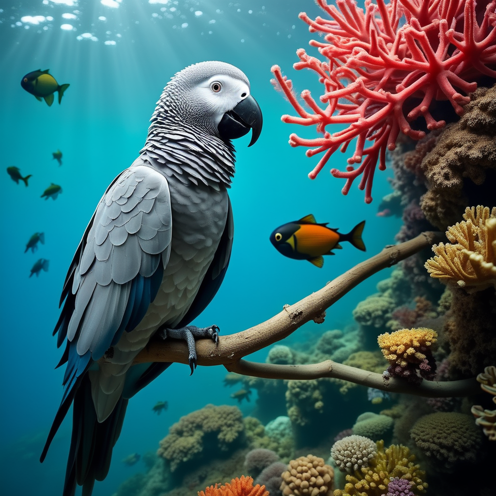
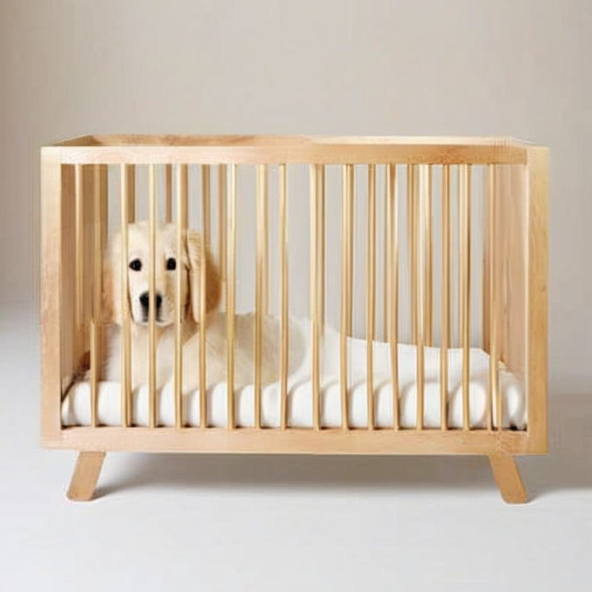

<h1 align="center">ImageRAG: Dynamic Image Retrieval for Reference-Guided Image Generation</h1>


<p align="center">
    <a href="https://rotem-shalev.github.io/ImageRAG/">
        
    </a>
    <a href="https://arxiv.org/abs/2502.09411">
            
    </a>
</p>

## Environment & Dependencies
First, create the ImageRAG environment:
```
conda env create -f environment.yml
conda activate ImageRAG
```

Next, save the dataset you wish to retrieve images from (the retrieval dataset) in the `datasets` folder, similarly to `example_dataset`.

## Usage

For Omnigen, clone the [OmniGen repo](https://github.com/VectorSpaceLab/OmniGen), and use `imageRAG_OmniGen.py` as follows:

```
python imageRAG_OmniGen.py \
--prompt <prompt> \
--dataset <retrieval_dataset> \
--omnigen_path <path_to_omnigen_dir> \
--openai_api_key <openai_api_key>
```

For example:

```
python imageRAG_OmniGen.py \
--prompt "An african grey underwater." \
--out_name "african_grey_underwater" \
--dataset "example_dataset" \
--omnigen_path <path_to_omnigen_dir> \
--openai_api_key <openai_api_key>
```

will generate:



For personalized generation, use ```--input_images <path_to_image>``` with an image of the subject you would like to generate.

For example:

```
python imageRAG_OmniGen.py \
--prompt "My cat wearing a Halloween costume. My cat is the cat in this image: <|image_1|>." \
--input_images "images/koshka.jpeg" \
--out_name "koshka_halloween" \
--dataset "example_dataset" \
--omnigen_path <path_to_omnigen_dir> \
--openai_api_key <openai_api_key>
```

will generate:


If the output image isn't satisfactory, You can try the 'generation' mode which retrieves all concepts and not only the missing ones.
For example:

```
python imageRAG_OmniGen.py \
--prompt "Origami birds flying over New York City." \
--mode "generation" \
--out_name "origami_birds_NYC" \
--dataset "example_dataset" \
--omnigen_path <path_to_omnigen_dir> \
--openai_api_key <openai_api_key>
```

will generate:


For SDXL, use ```imageRAG_SDXL.py``` as follows:

```
python imageRAG_SDXL.py \
--prompt <prompt> \
--dataset <retrieval_dataset> \
--openai_api_key <openai_api_key>
```

For example:

```
python imageRAG_SDXL.py \
--prompt "A golden retriever and a cradle." \
--out_name "golden_cradle" \
--dataset "example_dataset" \
--openai_api_key <openai_api_key>
```

will generate:



## Citation
If you find this repository useful, please cite our paper.
```
@misc{shalevarkushin2025imageragdynamicimageretrieval,
      title={ImageRAG: Dynamic Image Retrieval for Reference-Guided Image Generation}, 
      author={Rotem Shalev-Arkushin and Rinon Gal and Amit H. Bermano and Ohad Fried},
      year={2025},
      eprint={2502.09411},
      archivePrefix={arXiv},
      primaryClass={cs.CV},
      url={https://arxiv.org/abs/2502.09411}, 
}
```


